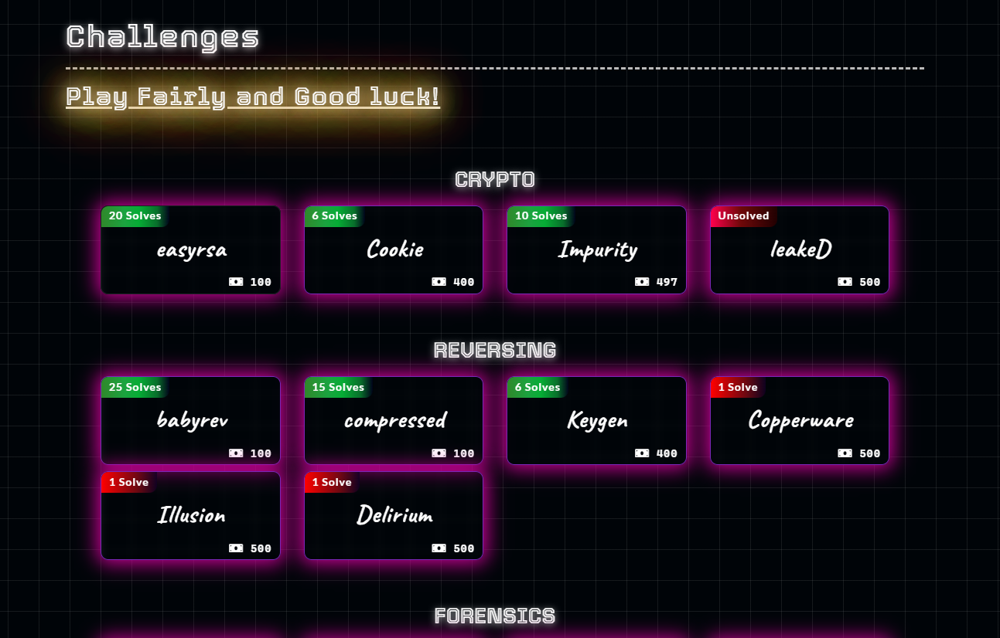
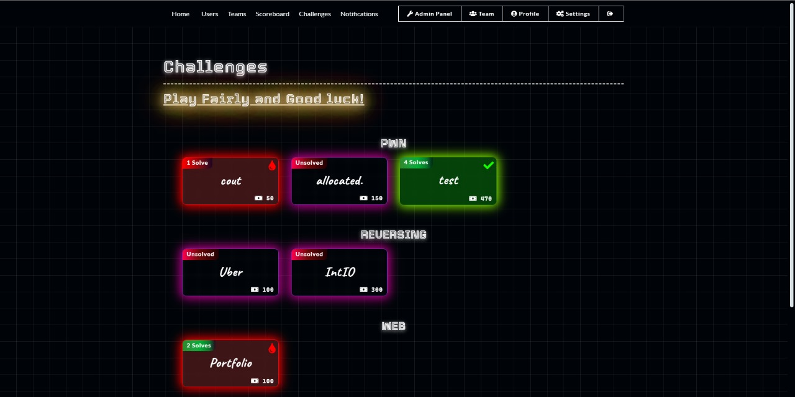
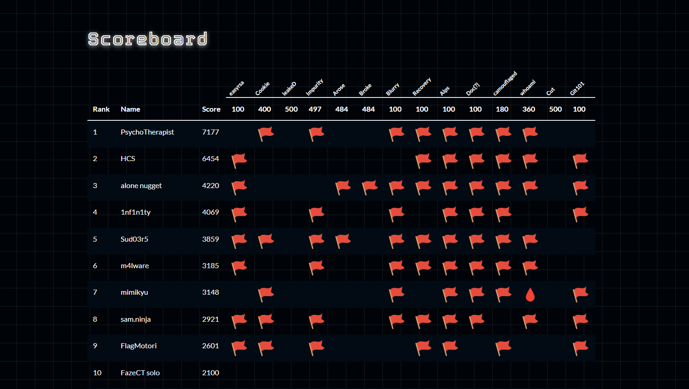

# AOFCTF - 2024

## Theme:

Challenges page from a users' perspective:

Challenges page from a user that has solves and blood:

Scoreboard:

To deploy challenges in waves and use [waves.json](waves.json):

[https://github.com/TheFlash2k/CTFd-Wave-Release](https://github.com/TheFlash2k/CTFd-Wave-Release)

## Total Registered Teams
374

## Solves

| Challenge Name | Category | Points | Solves |
| ---- | ---- | ---- | ---- |
| Birdy101 | Pwn | 464 | 4 |
| babysbx | Pwn | 496 | 2 |
| yip-yip | Pwn | 496 | 2 |
| naughty | Pwn | 484 | 3 |
| Panel | Pwn | 484 | 3 |
| Git101 | Misc | 100 | 12 |
| DancingSquares | Misc | 464 | 4 |
| Katana | Web | 304 | 8 |
| QrZilla | Web | 100 | 37 |
| Streamify | Web | 484 | 3 |
| Feedback | Web | 100 | 26 |
| Ba-Sing-Se | Misc | 100 | 16 |
| Insanity | Misc | 100 | 37 |
| Sanity | Misc | 50 | 127 |
| Arose | Forensics | 484 | 3 |
| Broke | Forensics | 484 | 3 |
| Popeye | Pwn | 500 | 1 |
| shush | Misc | 484 | 3 |
| Keygen | Reversing | 400 | 6 |
| easyrsa | Crypto | 100 | 20 |
| Blurry | Forensics | 100 | 28 |
| Copperware | Reversing | 500 | 1 |
| Illusion | Reversing | 500 | 1 |
| MusicOverflow2077 | Web | 100 | 14 |
| Recovery | Forensics | 100 | 11 |
| Alps | Forensics | 100 | 16 |
| Doc{?} | Forensics | 100 | 24 |
| camouflaged | Forensics | 180 | 33 |
| whoami | Forensics | 360 | 15 |
| Little Nightmare | Web | 100 | 21 |
| Cut | Forensics | 500 | 0 |
| rop101 | Pwn | 484 | 3 |
| babyrev | Reversing | 100 | 25 |
| Delirium | Reversing | 500 | 1 |
| Cookie | Crypto | 400 | 6 |
| compressed | Reversing | 100 | 15 |
| leakeD | Crypto | 500 | 0 |
| Impurity | Crypto | 497 | 10 |
| Survey | Misc | 10 | 20 |